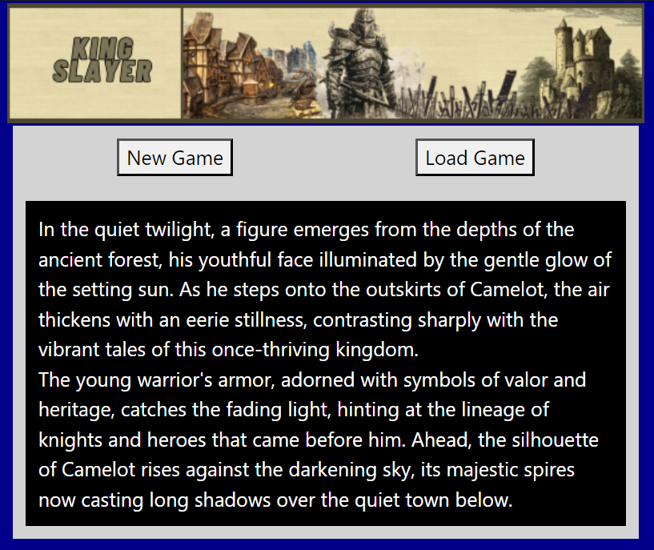

# King Slayer

**Author:** Leandro Garcia Tosi  
**Commission:** proyecto-coder-62005

## Description

**King Slayer** is an old-school style RPG game set in the world of Camelot. The main storyline revolves around King Arthur, who has gone mad and is terrorizing the people. The player must navigate through this world, gaining experience and gold to acquire powerful weapons and ultimately defeat King Arthur.

## Installation

There are no installation requirements. The game can be played directly on the web. Simply click the buttons to perform actions.

## How to Play

In **King Slayer**, your goal is to gain enough experience and gold to buy the best weapons and defeat King Arthur. The basic commands are:
- **Attack:** Engage enemies in combat.
- **Dodge:** Avoid incoming attacks.
- **Run:** Escape from battles.

There is also a hidden bonus within the game that can simplify the experience.

## Technologies Used

- **HTML**
- **JavaScript**
- **CSS**
- **sweetalert2** (library for alerts)
- **Bootstrap** (for styling)

## Contribution

Currently, contributions are not being accepted. However, feedback and suggestions are always welcome.

## License

This project does not have a specific license. Feel free to use the code and assets as you see fit.

## Contact

For any questions or issues, please contact Leandro Garcia Tosi.

## Screenshot

